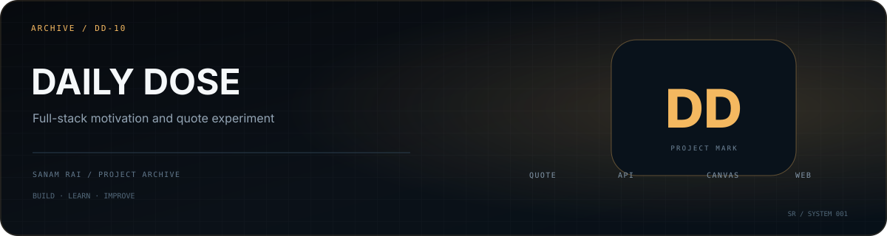

<p align="center">
  
</p>

# Daily Dose of Motivation

A full-stack learning project centered around **motivational quote content**. The repository separates a frontend and backend, with the backend built on Express and using Axios plus Canvas-related tooling.

## Repository structure

```text
Daily-Dose-of-Motivation/
├── Frontend/
└── Backend/
```

## Backend stack

- Node.js
- Express 5
- Axios
- Canvas
- CORS
- Nodemon

## Why I keep it

This project is part of my full-stack learning archive: working with external content, shaping a small backend around it, and connecting it to a separate frontend experience.

## Status

**Learning / archive project.**

---

**Sanam Rai** · [GitHub profile](https://github.com/SanamRai001)
